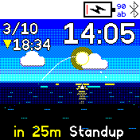

# sunrise watchface

This app mimics the Apple Watch watchface that shows the sunrise and sunset time.

* Requires to configure the location in Settings -> Apps -> My Location
* The sun (and moon, with its phase) follow a path that peaks at solar noon; the
  horizon is placed so the sun crosses it at sunrise and sunset, and the sky
  colours follow civil twilight
* The horizon is a time axis for the next 24 hours (left of the white triangle
  is tomorrow): yellow bars are calendar events, cyan bars are hours with rain
  forecast
* Shows the next calendar event (synced by Gadgetbridge) starting within the
  next day along the bottom: "in 25m" when it's close, "til 14:00" while it's
  on, and a cyan "+" if it's tomorrow
* Tap the screen to list everything coming up in the next day
* If the weather app has data, shows clouds/rain/snow/fog in the sky. Rain
  forecast bars need the weather app's data type set to "forecast"
* Settings -> Apps -> Sunrise turns weather, calendar and the moon on or off
* Follows the 12/24 hour setting, and supports fast loading

## TODO

* Add support for banglejs1
* Faster rendering, by only refreshing whats needed, etc
* Show alarms on the time axis

## Author

Written by pancake in 2023

## Screenshots

